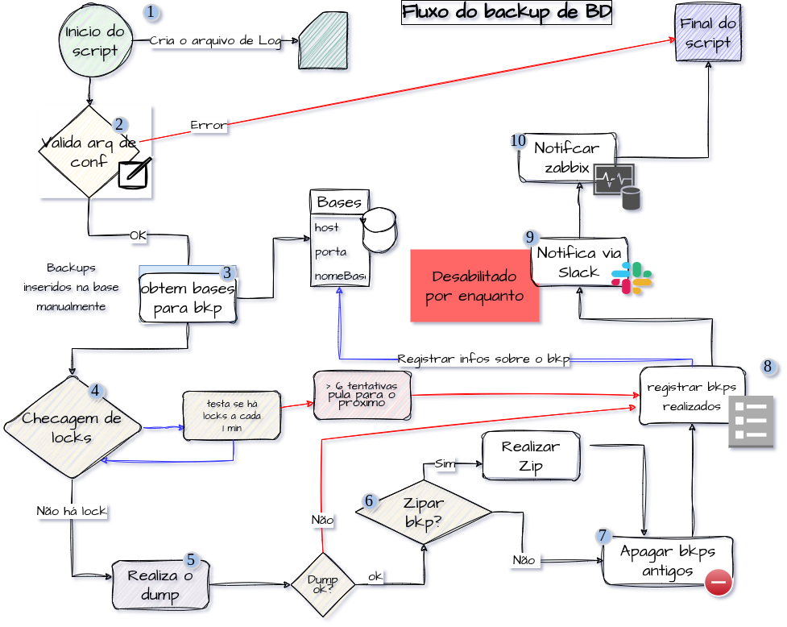

# Postgres backups
This is a script that perform a backup by container.
It can be zipped and can be notify a zabbix server

## Contents

- [1 - How to work](#1---How-to-work")
- [2 - Database Skeleton](#2---database-skeleton)
- [3 - Installation](#3---installation)
- [4 - Configuration File](#4---configuration-file)


### 1 - How to work

Basically it get connect information about some base and perform a dump for each base.
The script runs in multiprocess defined by configuration File. At the end it sends metrics to Zabbix



### 2 - Database skeleton
 

Bases in Bases table are inserted manually.
To add entries into Bases:

```sql
insert into bases values ('base', 'host', 'port', 'postgres', pgp_sym_encrypt('PASSWORD', 'KEY', compress-algo=aes256), False)'
```


### 3 - Installation

**by docker**:
 ```shell
 docker create --name backup-ENVIRONMENT \
 --hostname backup-ENVIRONMENT \
 -v /etc/localtime:/etc/localtime:ro \
 -v /media/docker/backups/dump:/backups/dump/ \
 -v /media/docker/backups/log:/backups/log/ \
 -v /media/docker/backups/ENVIRONMENT.yaml:/backups/conf.yaml:ro \
 --memory 4g \
 repositorio.local.br/backup:1.0.0
 ```

 configure crontab:
 ```shell
 00 23 * * * docker start backup-ENVIRONMENT
 ```

### 4 - Configuration File
follow configuration YAML file example:

```yaml
database:
  host: '127.0.0.1'
  port: '5433'
  user: 'postgres'
  pass: 'pass123'

zipPass: 'zip123' # optional

process: 8        # optional
retention: 4      # optional
environment: Local
zabbix:           # optional
  server: "127.0.0.1"
  port: "10051"
  host: "backup-ENVIRONMENT"
```
